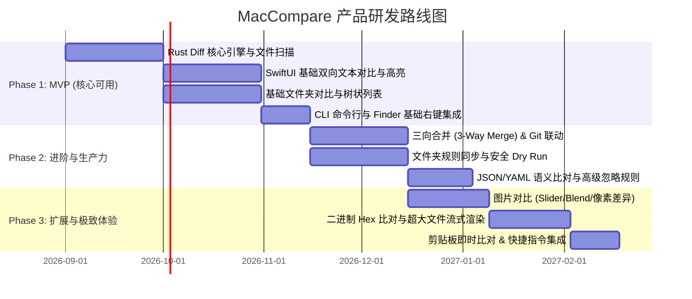

# 产品需求文档 (PRD)：MacCompare（暂定名）
> 一款专为 macOS 生态打造的高性能、现代原生文件与目录对比合并工具

---

## 1. 文档基本信息
- **文档版本**：v1.0.0
- **撰写人**：产品经理 (Product Manager)
- **目标平台**：macOS 26 (Tahoe) 及以上
- **硬件架构支持**：**全面适配 Intel-based Mac (x86_64) 与 Apple Silicon (arm64)**，采用 Universal Binary 2 通用二进制分发，保证两类架构下的同等极致体验与性能。
- **核心定位**：超越传统 Beyond Compare 在 Mac 端的陈旧移植体验，融合现代 macOS 原生质感与极致 Diff 性能的专业级对比/合并工具。

---

## 2. 背景与市场定位

### 2.1 市场痛点分析
1. **Beyond Compare (BC) Mac 版**：
   - UI 仍带有老旧跨平台框架痕迹（类 X11/Qt 移植风格），未遵循 Apple Human Interface Guidelines (HIG)。
   - 对 macOS 的 Retina 视网膜屏平滑滚动、暗黑模式切换、触控板手势支持不够优雅。
2. **Kaleidoscope**：
   - 设计精致，但价格极高（高门槛订阅制），且**文件夹对比、三向合并及大文件处理能力较弱**，偏向轻量代码审查。
3. **VS Code / JetBrains 内置 Diff**：
   - 缺少系统级的独立目录深度比对、规则化同步、以及针对超大文件/多媒体/二进制的高级对比能力。

### 2.2 产品定位与价值主张
- **Native & Beautiful**：100% 贴合 macOS 现代设计规范（毛玻璃材质、SF Pro 字体、流畅触控板阻尼惯性）。
- **Blazing Fast**：底层采用 Rust 编写核心 Diff 算法，百万行代码与 GB 级别大文件毫秒级索引与比对。
- **Developer & Power-User Friendly**：深度整合 Git/SVN 工作流、命令行 CLI、Finder 右键菜单与快捷指令。

---

## 3. 用户画像与核心使用场景

| 用户角色 | 核心场景 | 关键诉求 |
| :--- | :--- | :--- |
| **软件工程师** | 代码版本比对、Git 冲突解决 (3-Way Merge)、发布包代码比对 | 语法高亮、精准行内/字符级差异、忽略空白/注释、一键合并 |
| **运维 / DevOps** | 服务器配置比对 (Nginx/K8s YAML)、发布前后目录一致性校验、日志排查 | 超大日志文件对比、文件夹增量差异对比、哈希 CRC/MD5 校验 |
| **数据分析师 / 运营** | CSV / Excel 数据表比对、JSON/API 响应结构比对 | 智能列对齐、Key 自动排序、结构化树状图比对 |
| **设计与多媒体人员** | UI 界面切图比对、图标版本迭代 | 像素级高亮、卷帘滑动对比 (Slider)、透明通道支持 |

---

## 4. 核心功能架构与详细需求

```
                      MacCompare 功能架构
┌─────────────────────────────────────────────────────────────┐
│                       macOS 原生 UI 层                       │
│  (SwiftUI + AppKit / 标签页系统 / 浮窗对比 / 暗黑模式自适应)   │
├───────────────┬───────────────┬──────────────┬──────────────┤
│ 文本/代码对比 │ 文件夹/同步   │ 富数据对比   │ 扩展与生态   │
│ - 2-Way / 3-Way│ - 树状/扁平视图│ - JSON/YAML  │ - CLI 命令行 │
│ - 字符级 Diff │ - CRC/MD5校验 │ - CSV/Excel  │ - Finder集成 │
│ - 智能忽略规则│ - 规则化同步  │ - 图片对比   │ - Git Difftool│
│ - 一键合并采纳│ - 过滤规则    │ - 二进制Hex  │ - 剪贴板快速比│
├───────────────┴───────────────┴──────────────┴──────────────┤
│                     底层高性能核心引擎                      │
│        (Rust: Myers/Patience Diff + 多线程文件扫描 I/O)      │
└─────────────────────────────────────────────────────────────┘
```

> **UI 设计效果图已归档至项目目录**：
> - 文本与代码对比界面：`assets/text_diff_ui.jpg`
> - 文件夹对比与同步界面：`assets/folder_diff_ui.jpg`
> - 三向冲突合并界面：`assets/three_way_merge_ui.jpg`

---

### 4.1 模块一：文本与代码对比 (Text & Code Compare)

#### 功能清单
1. **对比视图模式**：
   - **双向比对 (2-Way Diff)**：左右并排 (Side-by-Side) 与 内联行模式 (Unified Diff)。
   - **三向合并 (3-Way Merge)**：本地 (Local) vs 基础基准 (Base) vs 远端 (Remote) + 底部实时输出结果区 (Result View)。
2. **差异粒度识别**：
   - 行级别 (Line Diff) -> 词级别 (Word Diff) -> 字符级别 (Character Diff)。
   - 智能代码块移动检测（检测代码段位置调换，而非简单标记为一删一增）。
3. **语法高亮与渲染**：
   - 自动识别并支持 60+ 种主流编程语言与标记语言（Rust, Swift, Python, Go, TS/JS, Java, C++, YAML, Markdown 等）。
   - 智能缩略 Mini-map，全景展示整文件差异分布。
4. **灵活的忽略过滤规则 (Ignore Rules)**：
   - 忽略空白字符（尾部空格、连续空格、Tab 与空格混用）。
   - 忽略换行符差异（CRLF / LF / CR）。
   - 忽略大小写 (Case-insensitive)。
   - 忽略注释（代码单行/多行注释忽略对比）。
   - 正则表达式自定义忽略（例如忽略时间戳 `\d{4}-\d{2}-\d{2}`、版本号等）。
5. **高效合并操作 (One-Click Merge)**：
   - 行内快捷操作按钮（Take Left, Take Right, Copy to Other Side）。
   - 批量操作：全部采纳左侧 / 全部采纳右侧 / 采纳所有非冲突项。
   - 编辑锁定保护（可针对某一侧开启“只读模式”，避免手误覆盖）。
6. **编码与格式支持**：
   - 自动识别 UTF-8, UTF-16, GBK, GB2312, Shift-JIS, ISO-8859 等常见编码，支持随时一键转换编码重载。

---

### 4.2 模块二：文件夹与目录对比/同步 (Folder Compare & Sync)

#### 功能清单
1. **视图与呈现**：
   - **目录树视图 (Hierarchy View)**：折叠/展开、自动对齐同名子目录与文件。
   - **扁平视图 (Flat List)**：忽略层级，快速罗列所有存在差异的文件。
2. **差异对比模式与策略**：
   - **极速模式 (Quick Mode)**：对比文件大小 (Size) + 最后修改时间 (Timestamp)。
   - **哈希校验 (Hash Mode)**：后台多线程计算 CRC32 / MD5 / SHA-256，防止时间戳被篡改。
   - **内容深度对比 (Full Content Mode)**：完全打开内容逐字节对比。
3. **文件过滤系统 (Filter Engine)**：
   - 内置排除预设：`.git/`, `.DS_Store`, `node_modules/`, `target/`, `build/`, `*.pyc` 等。
   - 自定义包含/排除通配符（如 `*.swift`, `!test_*`）及正则规则。
4. **目录同步与动作操作 (Sync Actions)**：
   - **单向镜像 (Mirror Left to Right / Right to Left)**：使目标完全与源一致（包含多余文件删除）。
   - **双向更新 (Update / Two-way Sync)**：将较新的修改覆盖旧文件，复制孤立文件。
   - **安全预览机制 (Dry Run)**：在执行实际文件覆盖/删除前，弹出拟操作列表及确认面板。

---

### 4.3 模块三：专用格式对比 (Specialized Compare)

1. **JSON / YAML 语义对比**：
   - 自动格式化对齐（Beautify）。
   - 忽略 Key 排序差异（语义等价比对）。
2. **表格与 CSV / TSV 对比**：
   - 自动识别表头行，支持设置主键列 (Primary Key) 进行跨行对齐匹配。
   - 单元格级数值差异高亮。
3. **图片比对 (Image Diff)**：
   - **滑动卷帘 (Swipe/Split Slider)**：拖动分界线查看前后变化。
   - **洋葱皮叠加 (Onion Skin / Blend)**：调节透明度重叠比对。
   - **差异高亮 (Highlight Differences)**：反色高亮变动像素。
   - 支持格式：PNG, JPG, WebP, SVG (含代码与渲染图双模式), HEIC, PSD。
4. **二进制与 Hex 对比 (Binary Diff)**：
   - 经典 16 进制 + ASCII 对应排版，差异字节红色高亮。

---

### 4.4 模块四：macOS 深度系统整合与开发者生态

1. **macOS 原生交互体验**：
   - **多标签页 (Tabs)**：支持多组对比任务在同一窗口平铺或切换。
   - **触控板手势支持**：双指平滑同步滚动 (Sync Scroll)、Pinch-to-zoom 缩放字号。
   - **暗黑/明亮模式无缝自适应**：跟随系统主题或独立配置配色方案。
2. **Finder 右键集成 (Services / Quick Actions)**：
   - 右键任意文件/目录 -> `MacCompare: 暂存为左侧对比项`。
   - 右键另一文件/目录 -> `MacCompare: 与暂存项对比`。
   - 同时框选两个文件/目录 -> `MacCompare: 直接对比选中文档`。
3. **命令行 CLI (`mcdiff`)**：
   ```bash
   mcdiff file_a.txt file_b.txt
   mcdiff /path/to/dir_a /path/to/dir_b
   mcdiff --merge local.py base.py remote.py -o merged.py
   ```
4. **Git / 终端生态无缝对接**：
   - 一键配置为 `git difftool` 和 `git mergetool`。
   - 支持通过标准输入管道接收内容对比：`cat file.txt | mcdiff - other.txt`。
5. **剪贴板快速对比 (Clipboard Diff)**：
   - 支持一键将当前剪贴板内容与选中文本/文件进行临时即时对比。

---

## 5. 非功能性需求 (NFR)

### 5.1 性能要求 (Performance)
- **大文件性能**：打开 500MB+ 文本日志文件时，采用虚拟滚动 (Virtual Scrolling) + 内存映射 (mmap) 技术，内存占用控制在 150MB 以内，UI 保持 60/120fps 不卡顿。
- **目录扫描性能**：10 万级文件数量的工程目录，极速对比时间 < 2 秒。
- **启动时间**：冷启动进入可用主界面 < 0.5 秒。

### 5.2 兼容性与架构
- **硬件架构与二进制分发**：
  - **Universal Binary 2**：一份安装包原生同时包含 `x86_64` (Intel) 与 `arm64` (Apple Silicon) 两份切片。
  - **Intel-based Mac 深度适配**：对 Intel 平台针对性启用 x86_64 编译器优化（如 SSE4.2 / AVX2 指令集加速哈希与内存对比），不依赖 Rosetta 2 转译，杜绝额外性能开销。
  - **Apple Silicon 深度适配**：支持 NEON SIMD 指令集加速。
- **系统版本**：最低支持 macOS 26 (Tahoe) 及以上，全面采用最新系统级 API 与现代视觉框架特性。
- **沙盒与安全性**：App Sandbox 友好设计，文件写操作支持本地安全撤销回退（自动保留 `.bak` 或临时缓存历史）。

---

## 6. 技术路线建议 (Tech Stack Recommendation)

推荐采用 **SwiftUI (前端) + Rust (核心引擎)** 的高性能现代化架构方案：

| 层次 | 选型 | 选型理由 |
| :--- | :--- | :--- |
| **UI 表现层** | **SwiftUI + AppKit** | 100% 原生 macOS 视觉观感、内存开销极低、触控板/手势/键盘快捷键支持最完美。 |
| **Diff 核心层** | **Rust (core-engine)** | 极致计算性能、内存安全、并发文件 I/O 扫描能力。可复用成熟的 Diff 算法库（如 `similar`, `imara-diff`）。 |
| **语言/语法解析**| **Tree-sitter** (C/Rust) | 毫秒级增量 AST 语法解析，保证代码高亮与折叠的精准与高速。 |
| **跨语言绑定** | **UniFFI / Swift-Bridge** | 零成本安全穿透 Swift 与 Rust，降低跨语言调用损耗。 |

---

## 7. 研发阶段规划与版本路线图 (Roadmap)



---

## 8. 产品经理建议与后续探讨方向 (Open Discussion)

1. **商业化模式考虑**：
   - **买断制 + 每年大版本更新支持**（类似 Raycast Pro / TablePlus / Sketch 模式），深受 macOS 专业开发者喜爱，避开单纯高昂月度订阅引起的用户反弹。
   - 基础 2-Way 文本对比开源/免费，专业级功能（3-Way、文件夹同步、专用格式对比）付费激活。
2. **核心技术预研建议**：
   - 先行验证 Rust 与 SwiftUI 之间的数据通信性能（如何高效传递几十万行的 diff hunk 坐标数据）。
