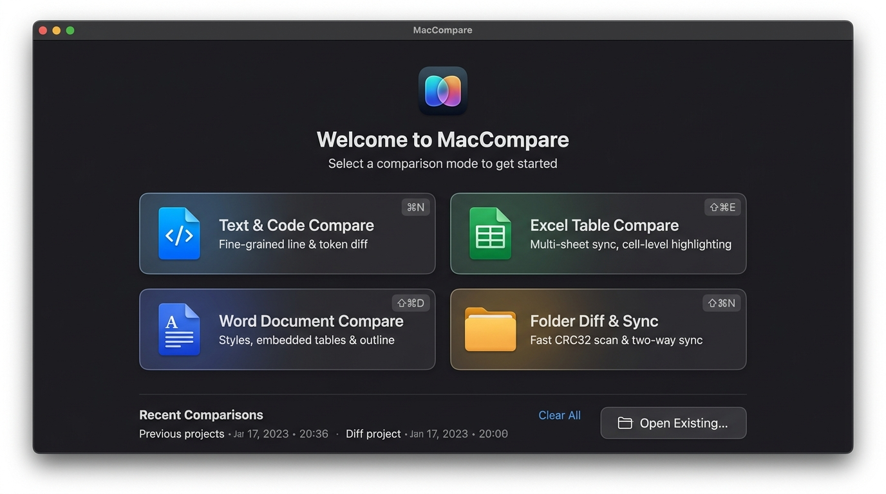
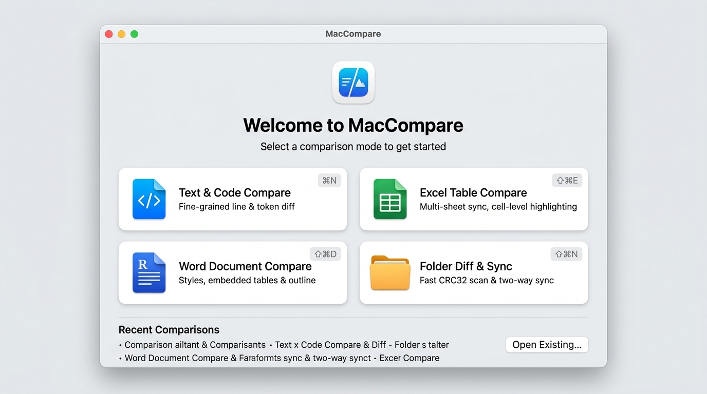
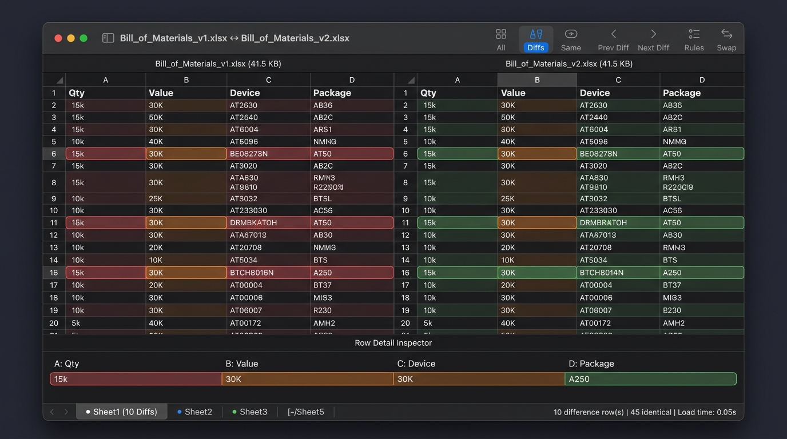
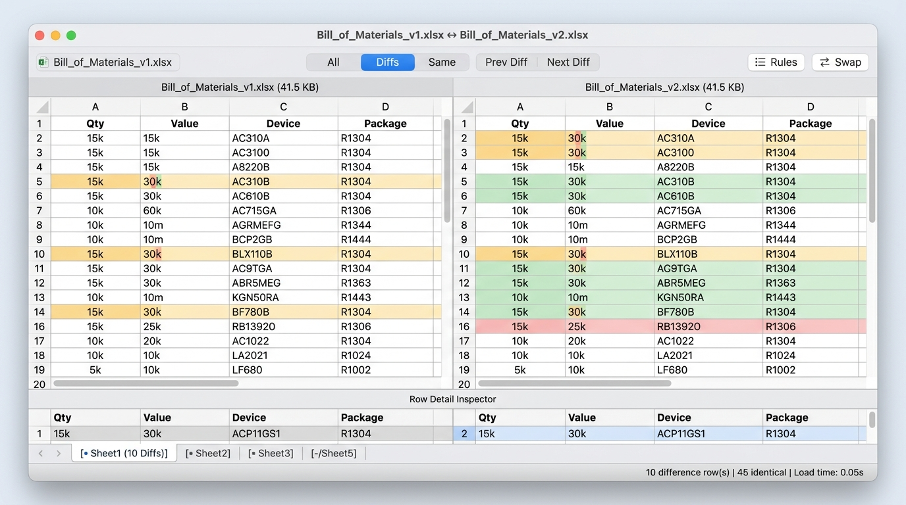
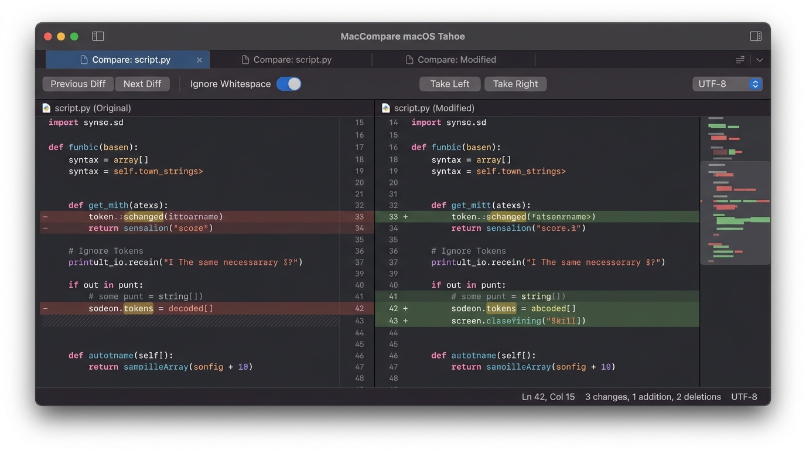
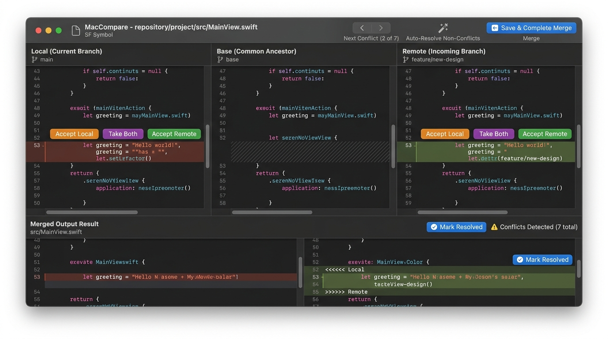
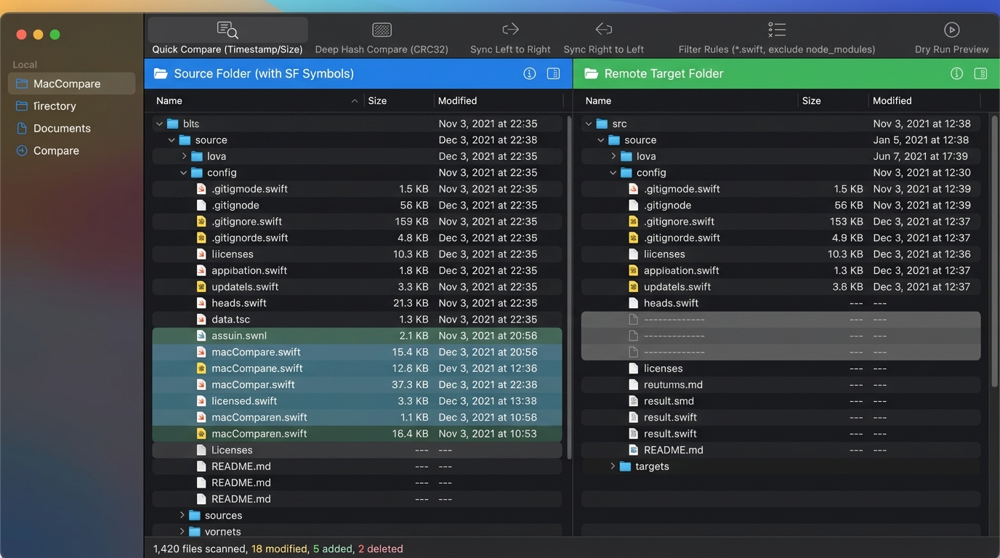

# MacCompare

<p align="center">
  <b>A modern, high-performance native file & directory comparison and merge suite for macOS.</b><br>
  <b>专为 macOS 生态打造的高性能、现代原生文件与目录对比合并工具。</b>
</p>

<p align="center">
  <a href="#english">English</a> • <a href="#简体中文">简体中文</a>
</p>

---

<a name="english"></a>
## English

> **MacCompare** is a high-performance, modern native file & directory comparison and merge tool tailored for macOS. Built with a high-performance Rust differential engine and native SwiftUI / AppKit, supporting Universal Binary 2 (Apple Silicon M-Series + Intel x86_64).

### 🌟 Key Features

- **🏠 Welcome Launcher Dashboard & Persistent History**:
  - **2x2 Balanced Launch Grid**: Direct one-click access to Text, Excel, Word, and Folder comparison modes.
  - **Recent Comparisons Hub**: Persistent session history powered by `UserDefaults`, allowing instant one-click session restore or clear.
  - **Independent Split Drop Zones**: Side-by-side dedicated drag-and-drop cards with single-file instant preview.
  - **Rapid Tab Navigation**: Seamless cycling through tabs via `⌃Tab` / `⌃⇧Tab`, and automatic fallback to home when closing all tabs.
- **📊 Excel & Spreadsheet Structured Comparison (.xlsx / .xls / .csv / .tsv)**:
  - **Multi-Sheet Navigation**: Automatic multi-sheet extraction and switching with visual diff-status badges.
  - **Side-by-Side Table Grid**: Pixel-perfect synchronized scrolling, smart row alignment (Key-based & LCS similarity) with phantom ghost rows.
  - **Cell-Level & Inline Diff**: Cell background diff highlights and granular character/word-level diffing.
  - **Row Detail Inspector**: Bottom expandable inspector card to review full column-by-column values for any selected row.
  - **Numeric Tolerance & Rules**: Configurable floating-point tolerance, case/whitespace toggles, and instant one-click merge.
- **📄 Structured Word Document Comparison (.docx / .doc)**:
  - **Body Text & Styling Diff**: High-fidelity paragraph text flow reconstruction, with granular diffing for font weight, italics, underline, font size, and color changes.
  - **Native Embedded Table Grid Diff**: Cell-level precision difference tracking (Green for additions, Red for deletions, Orange for modifications) without misalignments.
  - **Multimedia & Vector Graphics**: Deep SHA-256 fingerprint comparison for embedded images, audio/video, and attachments; native rendering of Word vector shapes (DrawingML Shape).
  - **Outline & Metadata**: Automatic extraction of H1~H6 heading outlines with one-click anchor navigation; comparison of author, creation/modification timestamps, and word count statistics.
- **⚡ Modern Native UI & Two-Stage Diff**: Native SwiftUI + AppKit architecture with macOS Tahoe material styling, Retina smooth scrolling, and seamless Dark/Light mode adaptation. Features line-level change positioning and word/character-level granular highlighting, complete with Phantom Line Alignment.
- **🔀 Git 3-Way Conflict Merge**: Visual 3-way conflict resolution across Local vs. Base vs. Remote, intelligent auto-merging of non-conflicting sections, and one-click conflict resolution.
- **📁 Blazing-Fast Folder Diff & Sync**: Quick timestamp/size checks and deep CRC32 hash comparison, featuring rule-based bidirectional synchronization with safe Dry-Run preview.
- **🛠️ Developer Ecosystem & CLI Integration**: Built-in `mcdiff` terminal CLI tool, with out-of-the-box integration for `git difftool` and `git mergetool`.

### 📸 Screenshots & UI Preview

#### 1. Welcome Launcher Dashboard (Home)

| Dark UI | Light UI |
| :---: | :---: |
|  |  |

#### 2. Excel / Spreadsheet Structured Comparison (Excel Diff)

| Dark UI | Light UI |
| :---: | :---: |
|  |  |

#### 3. Word Document Structured Comparison (Word Diff)

| Dark UI | Light UI |
| :---: | :---: |
|  |  |

#### 4. Fine-Grained Text & Code Comparison (Text Diff)

| 2-Way Text Diff | 3-Way Merge |
| :---: | :---: |
|  |  |

#### 5. Folder Fast Diff & Sync (Folder Diff)



### 📁 Project Structure

```
FileCompare/
├── docs/                             # Official website & documentation (GitHub Pages)
│   ├── assets/                       # Screenshots and web visual assets
│   ├── index.html                    # Homepage
│   ├── styles.css                    # Glassmorphism & adaptive responsive styles
│   └── script.js                     # Interactions & multi-language switcher (EN/ZH/JA)
│
├── core/                             # Rust high-performance core engine (Cargo Workspace)
│   ├── crates/diff-core/             # Myers/Patience Diff algorithm & 3-Way Merge
│   ├── crates/fs-scanner/            # Fast concurrent directory scanner & CRC32 hashing
│   ├── crates/syntax-highlighter/    # Tree-sitter incremental syntax highlighting interface
│   └── crates/maccompare-ffi/        # UniFFI / C-ABI cross-language bindings
│
├── macos/                            # macOS native application (Swift 6 / SPM)
│   ├── Package.swift                 # SPM modular configuration
│   ├── Sources/
│   │   ├── MacCompareKit/            # Core models, ViewModels, Excel/Word parsers & UI components
│   │   ├── MacCompare/               # macOS main application & AppCommands
│   │   └── mcdiff/                   # Terminal CLI comparison tool
│   └── Tests/MacCompareTests/        # Unit test suite
│
└── scripts/                          # Build and release automation scripts
    ├── build_universal_lib.sh        # Universal Binary 2 (arm64 + x86_64) compilation
    ├── package_dmg.sh                # Automated code signing & DMG release packaging
    └── run_app.sh                    # Build and run locally for testing
```

### 🚀 Quick Start

#### Build & Run Tests

```bash
cd macos
swift build
swift test
```

#### Using Terminal CLI (`mcdiff`)

```bash
# 1. Compare two Excel spreadsheets (.xlsx / .xls / .csv / .tsv)
mcdiff table_2025.xlsx table_2026.xlsx

# 2. Compare two Word documents (.docx / .doc)
mcdiff document_v1.docx document_v2.docx

# 3. Compare two text / code files
mcdiff file_a.txt file_b.txt

# 4. Compare two directories
mcdiff dir_a/ dir_b/

# 5. Git 3-Way conflict merge
mcdiff --merge local.py base.py remote.py -o merged.py
```

#### Configure as Default Git Diff & Merge Tool

```bash
git config --global merge.tool maccompare
git config --global mergetool.maccompare.cmd 'mcdiff "$LOCAL" "$REMOTE" -b "$BASE" -m "$MERGED"'
git config --global mergetool.maccompare.trustExitCode true

git config --global diff.tool maccompare
git config --global difftool.maccompare.cmd 'mcdiff "$LOCAL" "$REMOTE"'
```

#### Package Universal DMG Release

```bash
./scripts/package_dmg.sh 0.3.0
```

### 📄 License

This project is licensed under the [MIT License](LICENSE).

---

<a name="简体中文"></a>
## 简体中文

> **MacCompare** 是专为 macOS 生态打造的高性能、现代原生文件与目录对比合并工具。基于 Rust 高性能差分引擎与原生 SwiftUI/AppKit 深度构建，支持 Universal Binary 2 (Apple Silicon M系列 + Intel x86_64)。

### 🌟 核心特性
 
- **🏠 启动欢迎主页与会话历史记录**：
  - **2x2 黄金对称模式导航**：直达文本、Excel 表格、Word 文档与文件夹比对。
  - **全局最近比对记录 (Recent Comparisons)**：自动持久化存储近期比对历史，支持一键点击恢复会话与一键清空。
  - **左右独立分栏 Drop Zone**：支持左右两侧单独拖入文件，单侧即时表格/文档预览，两侧齐备自动触发对比。
  - **标签页高效循环切换**：支持 `⌃Tab` / `⌃⇧Tab` 快速在多个比对任务间循环切换，关闭所有 Tab 后自动回退至欢迎主页。
- **📊 Excel 与表格文件结构化全要素比对 (.xlsx / .xls / .csv / .tsv)**：
  - **多工作表自动识别与切换 (Multi-Sheet)**：自动解析提取所有 Sheet，底部标签栏带差异状态徽标。
  - **左右双栏表格与智能行对齐**：支持像素级双向锁定同步滚动，支持主键列（Key-based）对齐与 LCS 最长公共子序列相似度对齐，自动生成占位幽灵行（Phantom Row）。
  - **单元格级与内联字符级精准高亮**：新增绿、删除红、修改橙/粉，修改单元格内部支持字符/词级差异高亮。
  - **当前行明细检查器 (Row Detail Inspector)**：底部抽屉式展开当前选中行各列左右对比，轻松阅读长文本与具体数值。
  - **数值浮点容差与规则设置**：支持配置浮点数容差（Tolerance）、大小写与空白符忽略快捷 Switch 开关，支持一键左右采纳同步。
- **📄 Word 文档结构化全要素比对 (.docx / .doc)**：
  - **正文段落流与富文本样式差异**：高保真重构 Word 段落流，精细对比字体粗细、斜体、下划线、字号及颜色变更。
  - **原生嵌入式表格网格对比**：单元格级精准差异追踪（绿色新增、红色删除、橙色修改），排版不跑偏。
  - **多媒体指纹与矢量图形**：内嵌图片、音视频及附件深度 SHA-256 指纹比对；原生渲染 Word 矢量图形（DrawingML Shape）。
  - **大纲结构与元数据对比**：自动提取 H1~H6 标题大纲并支持一键定位；对比作者、创建/修改时间戳及字数统计。
- **⚡ 原生极致性能与两阶段精细比对**：纯原生 SwiftUI + AppKit 架构，macOS Tahoe 材质设计与视网膜流畅滚动，完美适配深浅外观。先定位行级变动，再高亮字符/词级差异，并提供智能占位对齐（Phantom Line Alignment）。
- **🔀 Git 三向冲突合并 (3-Way Merge)**：直观解决 Local vs Base vs Remote 冲突，智能自动解决非冲突部分，一键解决冲突。
- **📁 毫秒级文件夹对比与同步**：支持时间戳/大小快速检查与深度 CRC32 哈希对比，规则化双向同步并提供演练预览 (Dry-Run) 安全机制。
- **🛠️ 开发者生态与 CLI 命令行集成**：内置 `mcdiff` 终端命令行工具，完美无缝对接 `git difftool` 与 `git mergetool`。

### 📸 软件截图与界面预览

#### 1. 启动欢迎主页 (Welcome Hub)

| 深色模式 (Dark) | 浅色模式 (Light) |
| :---: | :---: |
|  |  |

#### 2. Excel / 表格文件结构化比对 (Excel Diff)

| 深色模式 (Dark) | 浅色模式 (Light) |
| :---: | :---: |
|  |  |

#### 3. Word 文档结构化全要素比对 (Word Diff)

| 深色模式 (Dark) | 浅色模式 (Light) |
| :---: | :---: |
|  |  |

#### 4. 文本与代码精细对比 (Text Diff)

| 双向文本对比 | Git 三向合并 |
| :---: | :---: |
|  |  |

#### 5. 文件夹极速对比与同步 (Folder Diff)


### 🚀 快速上手

#### 编译并运行单元测试

```bash
cd macos
swift build
swift test
```

#### 终端命令行使用 (`mcdiff`)

```bash
# 1. 对比两个 Excel / 表格文件 (.xlsx / .xls / .csv / .tsv)
mcdiff table_2025.xlsx table_2026.xlsx

# 2. 对比两个 Word 文档 (.docx / .doc)
mcdiff document_v1.docx document_v2.docx

# 3. 对比两个文本或代码文件
mcdiff file_a.txt file_b.txt

# 4. 对比两个目录
mcdiff dir_a/ dir_b/

# 5. 触发 Git 三向冲突合并
mcdiff --merge local.py base.py remote.py -o merged.py
```

#### 打包 Universal DMG 安装包

```bash
./scripts/package_dmg.sh 0.3.0
```

### 📄 开源许可证

本项目基于 [MIT License](LICENSE) 许可证开源。
