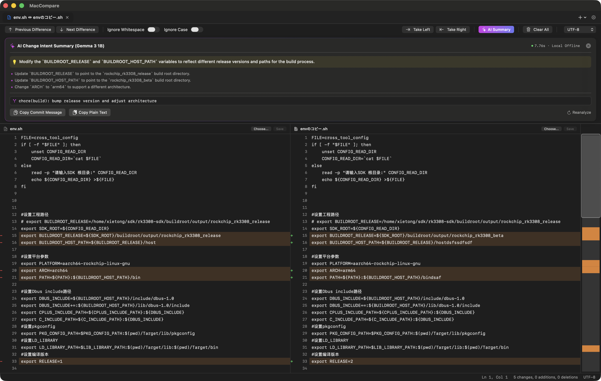
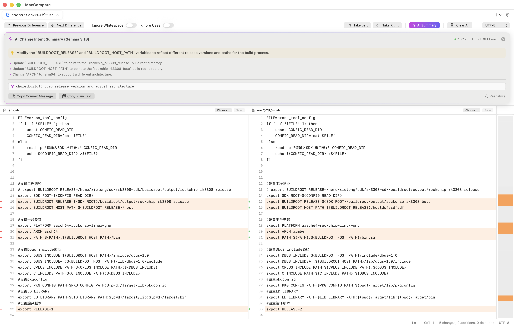
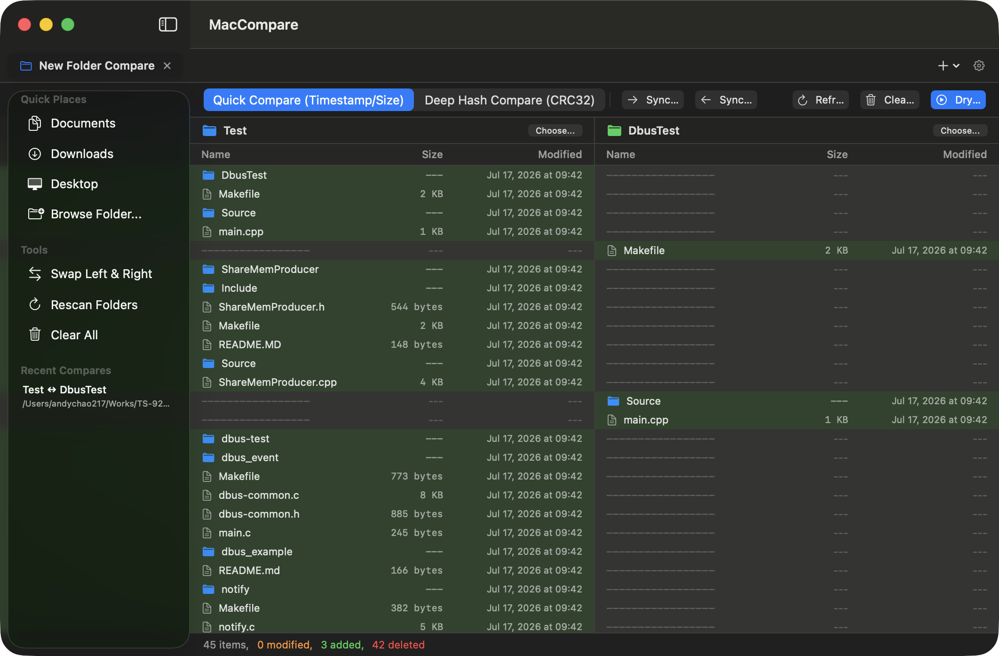

# MacCompare

<p align="center">
  <b>A modern, high-performance native file & directory comparison and merge suite for macOS.</b><br>
  <b>专为 macOS 生态打造的高性能、现代原生文件与目录对比合并工具。</b>
</p>

<p align="center">
  <a href="#english">English</a> • <a href="#简体中文">简体中文</a>
</p>

---

<a name="english"></a>
## English

> **MacCompare** is a high-performance, modern native file & directory comparison and merge tool tailored for macOS. Powered by a high-throughput Rust differential engine and native SwiftUI / AppKit, supporting Universal Binary 2 (Apple Silicon M-Series + Intel x86_64).

### 🌟 Key Features

- **🤖 Dual-Mode AI Assistant: Local Offline (Google Gemma 3) & Cloud/Ollama API**:
  - **100% On-Device Local AI (Google Gemma 3)**: Integrated on-device inference using Google Gemma 3 (1B-IT blazing fast & 4B-IT advanced). Completely offline, guaranteeing zero code leaks and strict privacy, with automatic memory cleanup after generation.
  - **OpenAI-Compatible Cloud & LAN LLMs**: Built-in presets for DeepSeek, OpenAI, Ollama (Local/LAN, e.g., `qwen2.5-coder`, `qwen3.5`, `llama3.2`), and any custom OpenAI-compatible endpoint. Includes 1-click latency and connectivity testing.
  - **Smart Change Intent Summary**: Instantly distills the overarching purpose of paired diffs into a concise one-line summary and extracts structured key modification bullet points with precise variable names.
  - **Automated Conventional Commits**: Generates standardized Git commit messages (e.g. `feat(core): ...`, `fix(ui): ...`) with 1-click clipboard copy.
- **⚡ High-Throughput Rust Core & Dual-Engine Architecture**:
  - **Dual-Engine Dispatcher (`Rust First + Swift Fallback`)**: Configurable engine mode (`Auto`, `Rust Core`, `Swift Native`) in Preferences with live engine health status.
  - **Myers & Token LCS Diff (`diff-core`)**: Sub-millisecond text diffing and 3-way merge conflict resolution.
  - **Concurrent Directory Scanner (`fs-scanner`)**: Multi-threaded parallel file traversal powered by `rayon` and hardware-accelerated `crc32fast`.
  - **Big-Data Spreadsheet Engine (`excel-diff-core`)**: High-throughput parsing via `calamine` (.xlsx/.xlsb/.xls/.ods) and `memmap2` (.csv/.tsv), 64-bit row hash fingerprinting with `ahash`, and Viewport Paging FFI maintaining a tiny 30~60MB memory footprint on million-row datasets.
- **📊 Excel & Spreadsheet Structured Comparison (.xlsx / .xlsb / .xls / .csv / .tsv)**:
  - **Multi-Sheet Navigation**: Automatic multi-sheet extraction and switching with visual diff-status badges.
  - **Pixel-Perfect Synchronized Grid**: Synchronized horizontal and vertical scrolling with sticky column headers (`pinnedViews: [.sectionHeaders]`) and exact column width alignment.
  - **Smart Row Alignment**: Primary key column hash join ($O(N)$) and LCS similarity matching with phantom ghost rows.
  - **Cell-Level & Inline Diff**: Cell background diff highlights and granular character/word-level diffing.
  - **Row Detail Inspector**: Bottom expandable inspector card to review full column-by-column values for any selected row.
  - **Numeric Tolerance & Rules**: Configurable floating-point tolerance (`|v1 - v2| <= tolerance`), case/whitespace toggles, and instant one-click merge.
- **📄 Structured Word Document Comparison (.docx / .doc)**:
  - **Body Text & Styling Diff**: High-fidelity paragraph text flow reconstruction, with granular diffing for font weight, italics, underline, font size, and color changes.
  - **Native Embedded Table Grid Diff**: Cell-level precision difference tracking (Green for additions, Red for deletions, Orange for modifications) without misalignments.
  - **Multimedia & Vector Graphics**: Deep SHA-256 fingerprint comparison for embedded images, audio/video, and attachments; native rendering of Word vector shapes (DrawingML Shape).
  - **Outline & Metadata**: Automatic extraction of H1~H6 heading outlines with one-click anchor navigation; comparison of author, creation/modification timestamps, and word count statistics.
- **🏠 Welcome Launcher Dashboard & Persistent History**:
  - **2x2 Balanced Launch Grid**: Direct one-click access to Text, Excel, Word, and Folder comparison modes.
  - **Recent Comparisons Hub**: Persistent session history powered by `UserDefaults`, allowing instant one-click session restore or clear.
  - **Independent Split Drop Zones**: Side-by-side dedicated drag-and-drop cards with single-file instant preview.
  - **Rapid Tab Navigation**: Seamless cycling through tabs via `⌃Tab` / `⌃⇧Tab`, and automatic fallback to home when closing all tabs.
- **🔀 Git 3-Way Conflict Merge**: Visual 3-way conflict resolution across Local vs. Base vs. Remote, intelligent auto-merging of non-conflicting sections, and one-click conflict resolution.
- **📁 Blazing-Fast Folder Diff & Sync**: Quick timestamp/size checks and deep CRC32 hash comparison, featuring rule-based bidirectional synchronization with safe Dry-Run preview.
- **🛠️ Developer Ecosystem & CLI Integration**: Built-in `mcdiff` terminal CLI tool, with out-of-the-box integration for `git difftool` and `git mergetool`.

### 📸 Screenshots & UI Preview

#### 1. Welcome Launcher Dashboard (Home)

| Dark UI | Light UI |
| :---: | :---: |
|  |  |

#### 2. Excel / Spreadsheet Structured Comparison (Excel Diff)

| Dark UI | Light UI |
| :---: | :---: |
|  |  |

#### 3. Word Document Structured Comparison (Word Diff)

| Dark UI | Light UI |
| :---: | :---: |
|  |  |

#### 4. Fine-Grained Text & Code Comparison with AI Summary (Text Diff)

| Dark UI (AI Intent Summary) | Light UI (AI Intent Summary) |
| :---: | :---: |
|  |  |

#### 5. Git 3-Way Conflict Merge


#### 6. Folder Fast Diff & Sync (Folder Diff)


### 📁 Project Structure

```
FileCompare/
├── docs/                             # Official website & documentation (GitHub Pages)
│   ├── assets/                       # Screenshots and web visual assets
│   ├── index.html                    # Homepage
│   ├── styles.css                    # Glassmorphism & adaptive responsive styles
│   └── script.js                     # Interactions & multi-language switcher (EN/ZH/JA)
│
├── core/                             # High-performance Rust core engine (Cargo Workspace)
│   ├── crates/diff-core/             # Myers Diff algorithm, token LCS & 3-Way Merge
│   ├── crates/fs-scanner/            # Parallel directory scanner (rayon) & CRC32 hash
│   ├── crates/excel-diff-core/       # Big-data spreadsheet engine (calamine, memmap2, ahash)
│   ├── crates/syntax-highlighter/    # Tree-sitter incremental syntax highlighting interface
│   └── crates/maccompare-ffi/        # C-ABI cross-language bindings & FFI export layer
│
├── macos/                            # macOS native application (Swift 6 / SPM)
│   ├── Package.swift                 # SPM modular configuration
│   ├── Sources/
│   │   ├── CMacCompareCore/          # C-bridge modulemap & headers linking Rust static library
│   │   ├── MacCompareKit/            # Core models, ViewModels, Dual-Engine dispatcher & UI
│   │   ├── MacCompare/               # macOS main application & AppCommands
│   │   └── mcdiff/                   # Terminal CLI comparison tool
│   └── Tests/MacCompareTests/        # Unit test suite (Swift + Rust FFI integration)
│
└── scripts/                          # Build and release automation scripts
    ├── build_universal_lib.sh        # Universal Binary 2 (arm64 + x86_64) Rust compilation
    ├── package_dmg.sh                # Automated code signing & DMG release packaging
    └── run_app.sh                    # Build and run locally for testing
```

### 🚀 Quick Start

#### Build & Run Tests

```bash
# 1. Run all Rust unit tests
cd core && cargo test --workspace

# 2. Run all Swift unit tests (includes Rust FFI integration tests)
cd ../macos && xcrun swift test
```

#### Using Terminal CLI (`mcdiff`)

```bash
# 1. Compare two Excel spreadsheets (.xlsx / .xlsb / .xls / .csv / .tsv)
mcdiff table_2025.xlsx table_2026.xlsx

# 2. Compare two Word documents (.docx / .doc)
mcdiff document_v1.docx document_v2.docx

# 3. Compare two text / code files
mcdiff file_a.txt file_b.txt

# 4. Compare two directories
mcdiff dir_a/ dir_b/

# 5. Git 3-Way conflict merge
mcdiff --merge local.py base.py remote.py -o merged.py
```

#### Configure as Default Git Diff & Merge Tool

```bash
git config --global merge.tool maccompare
git config --global mergetool.maccompare.cmd 'mcdiff "$LOCAL" "$REMOTE" -b "$BASE" -m "$MERGED"'
git config --global mergetool.maccompare.trustExitCode true

git config --global diff.tool maccompare
git config --global difftool.maccompare.cmd 'mcdiff "$LOCAL" "$REMOTE"'
```

#### Package Universal DMG Release (Universal Binary 2)

```bash
bash scripts/package_dmg.sh 0.5.0
```

### 📄 License

This project is licensed under the [MIT License](LICENSE).

---

<a name="简体中文"></a>
## 简体中文

> **MacCompare** 是专为 macOS 生态打造的高性能、现代原生文件与目录对比合并工具。基于 Rust 高性能差分引擎与原生 SwiftUI/AppKit 深度构建，支持 Universal Binary 2 (Apple Silicon M系列 + Intel x86_64)。

### 🌟 核心特性

- **🤖 端侧离线与云端双模 AI 智能助手 (Dual-Mode AI: Local Offline & Cloud/Ollama API)**：
  - **100% 端侧离线模型 (Google Gemma 3)**：内置 Google Gemma 3 1B-IT（推荐·极速）与 4B-IT（进阶·复杂合并）轻量模型。100% 本地运算，断网完全可用，代码与差异绝不上云，保护数据隐私，并在推理后自动释放显存；
  - **云端与局域网大模型兼容 API**：预设深度适配 DeepSeek、OpenAI 以及本地/局域网 Ollama（如 `qwen2.5-coder`、`qwen3.5`、`llama3.2`）与自定义端点，提供一键连通性测试与毫秒级延迟检测；
  - **变更意图智能提炼 (Change Intent Summary)**：自动分析成对代码差异，秒级提炼「一句话修改目的」并输出准确匹配变量名的「核心变更要点清单」；
  - **规范化 Git Commit 提交说明生成**：自动生成符合规范的 Git Conventional Commit 提交信息（如 `feat(core): ...`、`fix(parser): ...`），支持一键复制到剪贴板。
- **⚡ Rust 高性能核心与双引擎架构 (Dual-Engine Architecture)**：
  - **双引擎智能分发 (`Rust First + Swift Fallback`)**：支持在偏好设置中自由切换引擎模式（`自动选择`、`Rust 核心`、`原生 Swift`），并实时展示 Rust 引擎运行状态；
  - **Myers 与 Token LCS 差分 (`diff-core`)**：毫秒级完成行级差分与 Git 三向冲突合并；
  - **多线程并发目录扫描 (`fs-scanner`)**：基于 `rayon` 与硬件加速 `crc32fast` 实现超高速文件夹对比与深度指纹校验；
  - **海量表格与大数据引擎 (`excel-diff-core`)**：集成 `calamine`（.xlsx/.xlsb/.xls/.ods）与 `memmap2` 零拷贝内存映射（.csv/.tsv），利用 `ahash` 64位行哈希快速排除无差异行，并通过 FFI 视口分页（Viewport Paging）实现百万行表格秒级比对，前端内存占用恒定在 30~60MB。
- **📊 Excel 与表格文件结构化全要素比对 (.xlsx / .xlsb / .xls / .csv / .tsv)**：
  - **多工作表自动识别与切换 (Multi-Sheet)**：自动解析提取所有 Sheet，底部标签栏带差异状态徽标。
  - **像素级双向同步表格网格**：表头与数据行采用统一滚动容器，支持横向与纵向完美同步滚动，列宽精确对齐，表头吸顶固定 (`pinnedViews: [.sectionHeaders]`)。
  - **智能行对齐机制**：支持主键列 $O(N)$ 极速 Hash Join 对齐与 LCS 最长公共子序列相似度对齐，自动生成占位幽灵行（Phantom Row）。
  - **单元格级与内联字符级精准高亮**：新增绿、删除红、修改橙/粉，修改单元格内部支持字符/词级差异高亮。
  - **当前行明细检查器 (Row Detail Inspector)**：底部抽屉式展开当前选中行各列左右对比，轻松阅读长文本与具体数值。
  - **数值浮点容差与规则设置**：支持配置浮点数容差（Tolerance `|v1 - v2| <= tolerance`）、大小写与空白符忽略快捷 Switch 开关，支持一键左右采纳同步。
- **📄 Word 文档结构化全要素比对 (.docx / .doc)**：
  - **正文段落流与富文本样式差异**：高保真重构 Word 段落流，精细对比字体粗细、斜体、下划线、字号及颜色变更。
  - **原生嵌入式表格网格对比**：单元格级精准差异追踪（绿色新增、红色删除、橙色修改），排版不跑偏。
  - **多媒体指纹与矢量图形**：内嵌图片、音视频及附件深度 SHA-256 指纹比对；原生渲染 Word 矢量图形（DrawingML Shape）。
  - **大纲结构与元数据对比**：自动提取 H1~H6 标题大纲并支持一键定位；对比作者、创建/修改时间戳及字数统计。
- **🏠 启动欢迎主页与会话历史记录**：
  - **2x2 黄金对称模式导航**：直达文本、Excel 表格、Word 文档与文件夹比对。
  - **全局最近比对记录 (Recent Comparisons)**：自动持久化存储近期比对历史，支持一键点击恢复会话与一键清空。
  - **左右独立分栏 Drop Zone**：支持左右两侧单独拖入文件，单侧即时表格/文档预览，两侧齐备自动触发对比。
  - **标签页高效循环切换**：支持 `⌃Tab` / `⌃⇧Tab` 快速在多个比对任务间循环切换，关闭所有 Tab 后自动回退至欢迎主页。
- **🔀 Git 三向冲突合并 (3-Way Merge)**：直观解决 Local vs Base vs Remote 冲突，智能自动解决非冲突部分，一键解决冲突。
- **📁 毫秒级文件夹对比与同步**：支持时间戳/大小快速检查与深度 CRC32 哈希对比，规则化双向同步并提供演练预览 (Dry-Run) 安全机制。
- **🛠️ 开发者生态与 CLI 命令行集成**：内置 `mcdiff` 终端命令行工具，完美无缝对接 `git difftool` 与 `git mergetool`。

### 📸 软件截图与界面预览

#### 1. 启动欢迎主页 (Welcome Hub)

| 深色模式 (Dark) | 浅色模式 (Light) |
| :---: | :---: |
|  |  |

#### 2. Excel / 表格文件结构化比对 (Excel Diff)

| 深色模式 (Dark) | 浅色模式 (Light) |
| :---: | :---: |
|  |  |

#### 3. Word 文档结构化全要素比对 (Word Diff)

| 深色模式 (Dark) | 浅色模式 (Light) |
| :---: | :---: |
|  |  |

#### 4. 文本与代码精细对比（内置 AI 智能意图摘要）(Text Diff with AI)

| 深色模式 (Dark) | 浅色模式 (Light) |
| :---: | :---: |
|  |  |

#### 5. Git 三向冲突合并 (3-Way Merge)


#### 6. 文件夹极速对比与同步 (Folder Diff)



### 🚀 快速上手

#### 编译并运行单元测试

```bash
# 1. 运行全部 Rust 单元测试
cd core && cargo test --workspace

# 2. 运行全部 Swift 单元测试（含 Rust FFI 集成测试）
cd ../macos && xcrun swift test
```

#### 终端命令行使用 (`mcdiff`)

```bash
# 1. 对比两个 Excel / 表格文件 (.xlsx / .xlsb / .xls / .csv / .tsv)
mcdiff table_2025.xlsx table_2026.xlsx

# 2. 对比两个 Word 文档 (.docx / .doc)
mcdiff document_v1.docx document_v2.docx

# 3. 对比两个文本或代码文件
mcdiff file_a.txt file_b.txt

# 4. 对比两个目录
mcdiff dir_a/ dir_b/

# 5. 触发 Git 三向冲突合并
mcdiff --merge local.py base.py remote.py -o merged.py
```

#### 打包 Universal DMG 安装包 (Universal Binary 2)

```bash
bash scripts/package_dmg.sh 0.5.0
```

### 📄 开源许可证

本项目基于 [MIT License](LICENSE) 许可证开源。
